This document is a work-in-progress. Please raise an issue if you encounter an issue or confusion.

----

## Set up data fabric object tiering

### Overview

In this tutorial, we walk through an object tiering example where we have a requirement for a fast ingest zone using SSD disks.  The data is ingested into hosts with the SSDs and object tiering is used to move the data automatically to hosts with slower but cheaper storage.

### Recommended 

- Read
  - https://mapr.com/docs/61/StorageTiers/Intro.html
  - https://mapr.com/docs/61/AdvancedInstallation/InstallMASTGateway.html
- Watch
  - Manage Data with Volumes and Topology: [link](https://www.youtube.com/watch?v=CwkkojVYruw)
  - MapR Multi-Tier Data Platform - Demo: [link](https://www.youtube.com/watch?v=x0Fpd1jcdsU)


### Pre-requisites

 - HPE Container Platform 5.x deployed
 - You will need 6 unused hosts to add as worker nodes

### Add SSD Hosts to EPIC

Add hosts to EPIC that have SSDs.  **Disable Virtual Node Assignment** on these hosts [Instructions](http://docs.bluedata.com/50_enabling-disabling-a-worker) as in this scenario, we would like to have these nodes dedicated to storage and not to be used for compute.

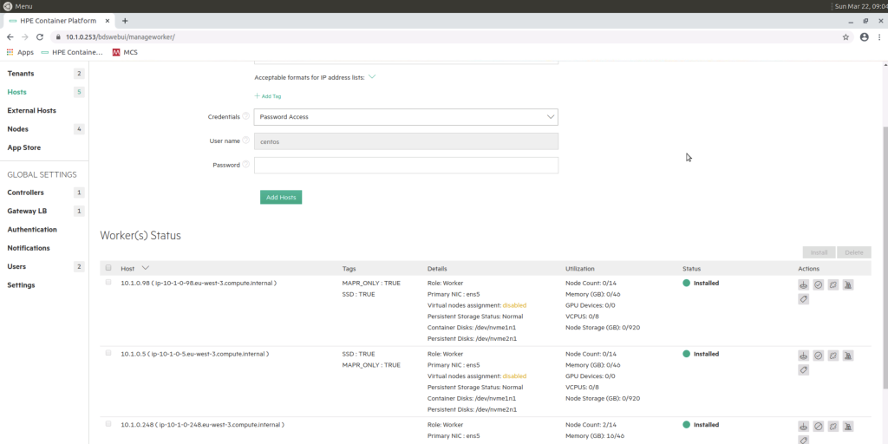

We create tags for the SSD hosts to indicate to the HPE Container Platform administrator that these hosts are for storage only and should not be used for compute. 

Click the Manage Tags button:
 
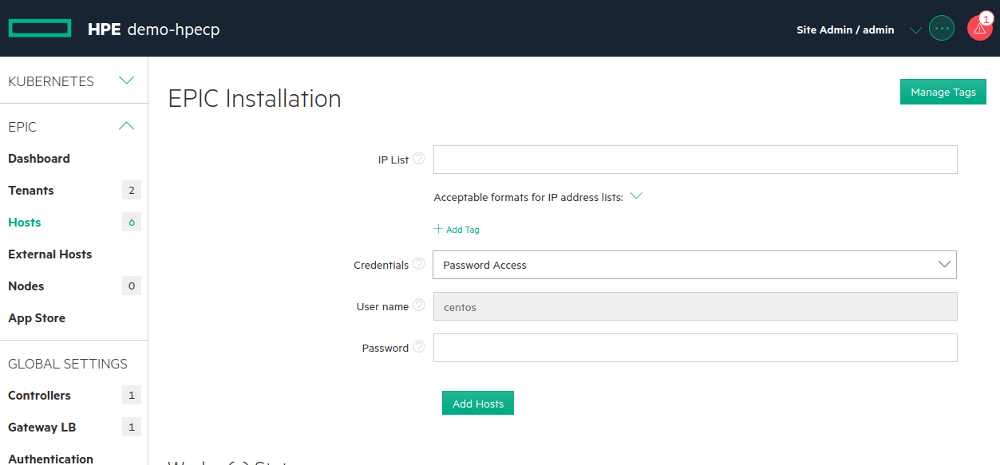

Update tags

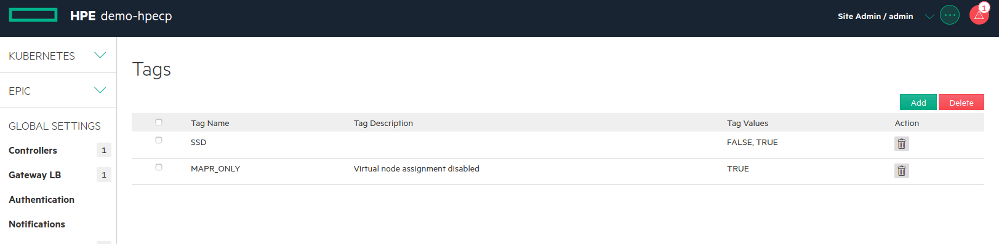
 
Assign SSD: TRUE to 2 of the workers, SSD: FALSE to remaining 5.

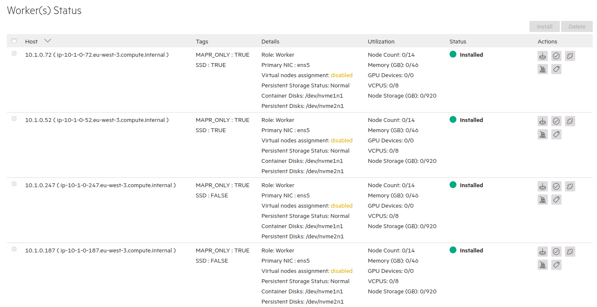
 
 - We need min 1 nodes in “SSD: TRUE” nodes, and choose to have replication factor of 1 (not recommended in real world).
 - We need min 5 nodes (3+2 EC) (recommended min 6 for 4+2 EC) in “SSD: FALSE” nodes. 

### Configure/update topologies for the nodes in MCS

Login to MAPR Control System (MCS) - [Instructions](./README-LOGIN-MAPR-CONTROL-SYSTEM.md)

Selected 2 SSD:TRUE nodes and assign them to /SSDTier topology (new topology under /).

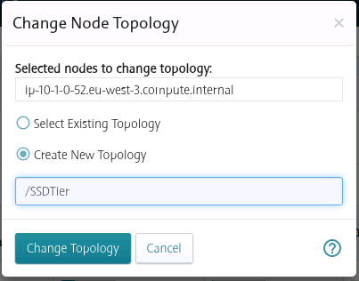

Assign remaining nodes (“SSD:FALSE”) to /CapacityTier

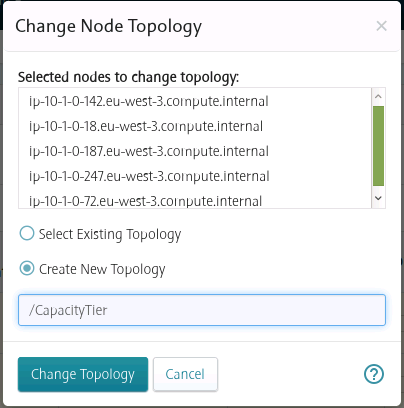

Eventually we should have 1 node in /SSDTier and 5 nodes in /CapacityTier topologies.

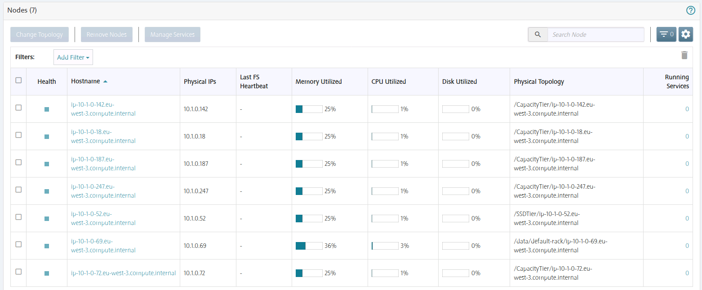

Now create a volume with /SSDTier and replication factor 1.

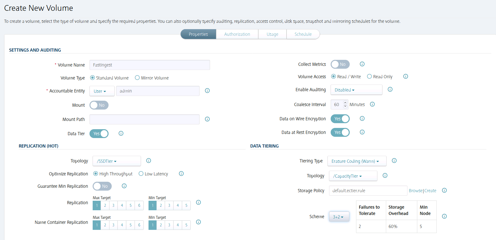

Note that:
 -	Volume is not mounted
 -	Data Tier enabled (cannot change this after creation)
 -	For “REPLICATION (HOT)”
    -	Topology is set to “/SSDTier” 
    -	Replication and Name Container Replication Min/Max targets are set to 1 (don’t do this in production)
 -	For “DATA TIERING”
    -	Tiering type is set to “Erasure Coding (Warm)” - cannot change this once selected
    -	Topology set to “/CapacityTier”
    - Storage Policy (offload schedule) left as default system scheduler (or you can create/select another)
    - EC Scheme set to 3+2
 
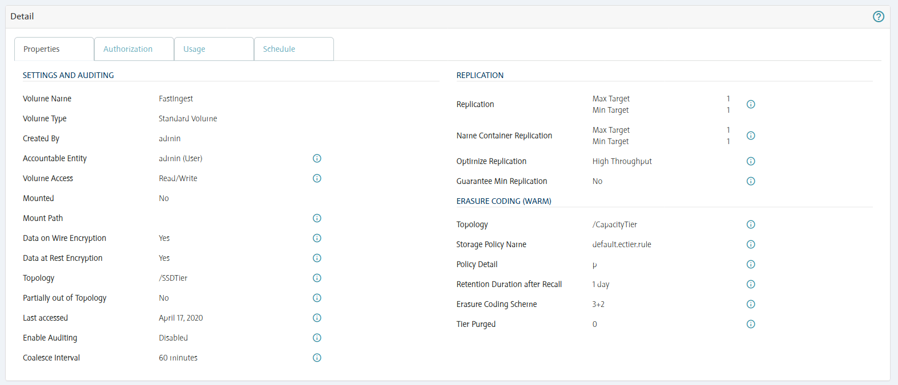

Now Create a mount point 
 
```
[centos@controller /]# bdmapr --root bash
[root@ip-10-1-0-253 /]#  cd /mapr/mnt/hcp.mapr.cluster/ 
[root@ip-10-1-0-253 /]#  mkdir SSDTier 
[root@ip-10-1-0-253 /]#  chmod 777 -R SSDTier/ 
[root@ip-10-1-0-253 /]#  chown –R mapr:mapr SSDTier/ 
```
 
You can now mount the volume in the MCS to /SSDTier/Fast_Ingest 
 
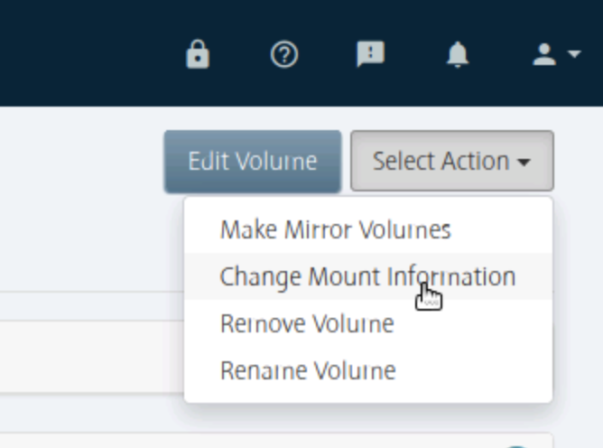
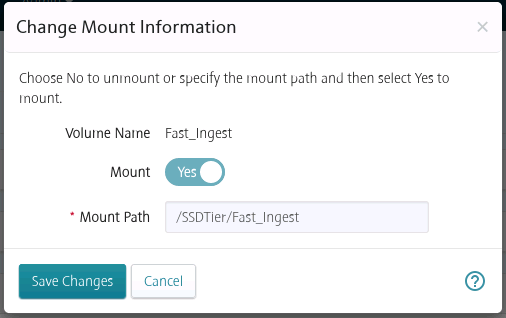
 
Test by loading some data: 

Within MapR container (“bdmapr --root bash” from controller).

```
[root@ip-10-1-0-253 hcp.mapr.cluster]# cd /mapr/hcp.mapr.cluster/SSDTier/Fast_Ingest
[root@ip-10-1-0-253 hcp.mapr.cluster]# curl http://212.183.159.230/1GB.zip > 1GB.zip 
[root@ip-10-1-0-253 hcp.mapr.cluster]# for I in $(seq 100); do cp 1GB.zip 1GB.zip_${I}; done; 
``` 

Now all data is on SSDTier (observe the Physical Topology column in the table):

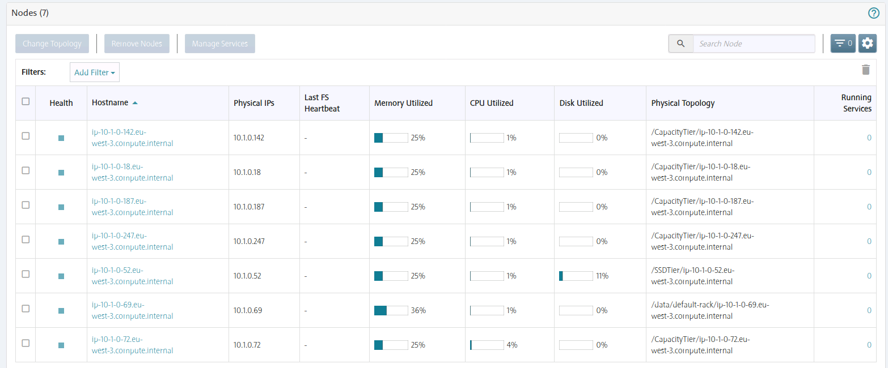


Next, run the offload manually to verify data offload working as expected to “/Capacity Tier”.
Before that, we need to install & register MapR MAST Gateway on all nodes that is running tiering (all SSD:TRUE tagged nodes).
Switch to the node that has SSDTier (SSD:TRUE tagged) and log into MapR container:
 


```
yum install -y mapr-mastgateway --nogpgcheck
maprlogin passwd -user mapr
# (use mapr-user password at /mapr/conf/mapr-pass)

maprcli node services -name mastgateway -nodes `hostname -i` -action enable
maprcli node services -name mastgateway -nodes `hostname -i` -action start
Register the mastgateway with CLDB
/opt/mapr/server/configure.sh -R

#Verify that MAST Gateway is registered with CLDB
maprcli service list
```

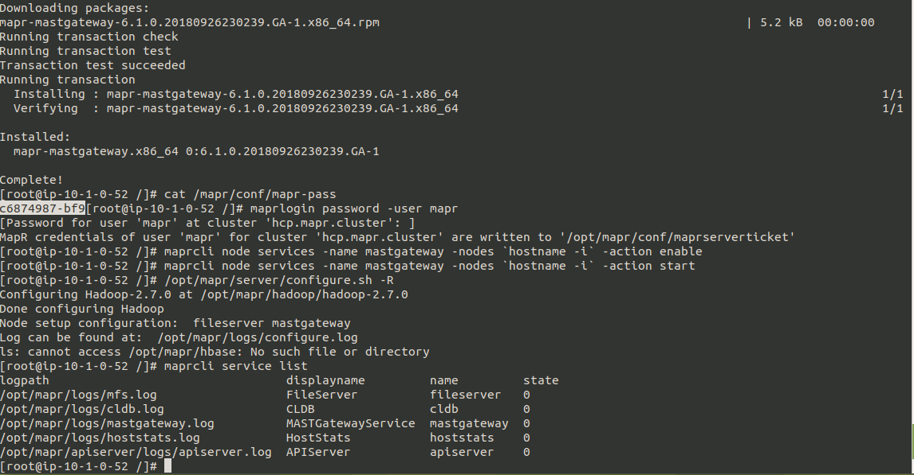

Now go to Data – Volumes on MCS, end manually initiate Data Offload task.
 

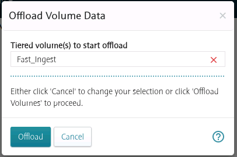

Select “Tiered Volumes” and you will see the status of data offload task.

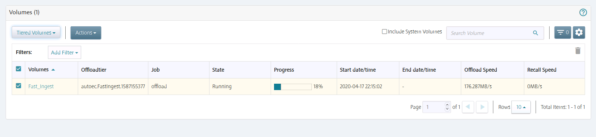

Once data offload is completed:
 
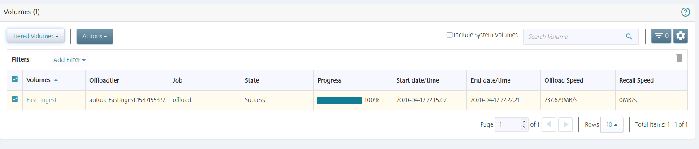

Check node storage utilization to verify data is being migrated to /CapacityTier
 
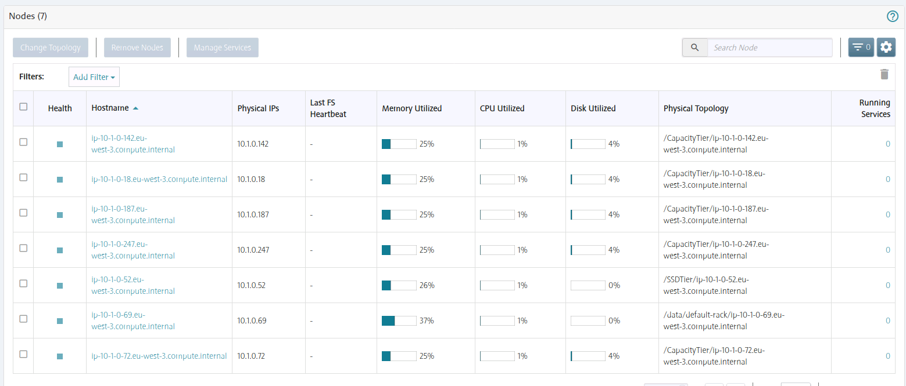
