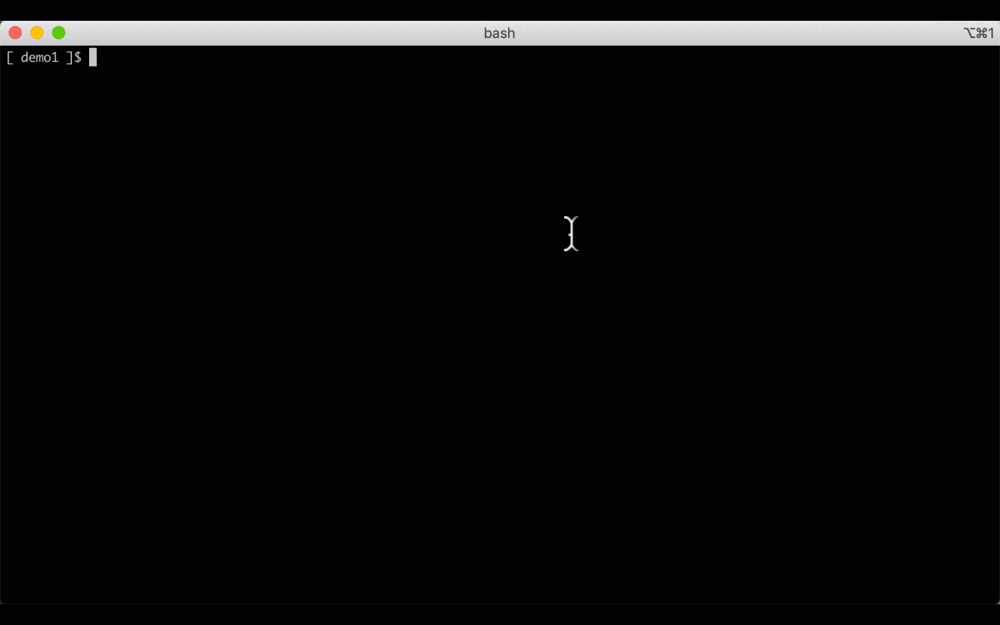
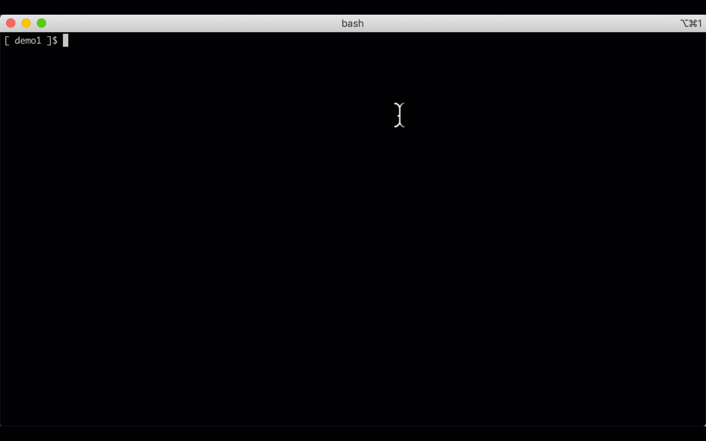

### Stopping, Starting and viewing the running status of your EC2 instances

Some scripts were generated for you to view the status of your EC2 instances managed by this terraform project.

- `./bin/ec2_stop_all_instances.sh` to stop your instances
- `./bin/ec2_start_all_instances.sh` to start your instances
- `./bin/ec2_instance_status.sh` to view running instances

------

### Stopping instances - example

### Starting instances - example

### Running instances - example

