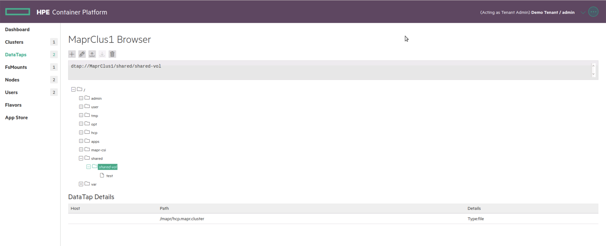
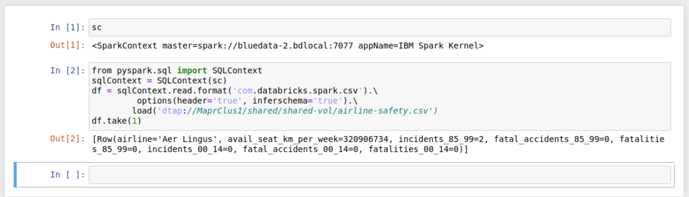

This document is a work-in-progress. Please raise an issue if you encounter an issue or confusion.

----

## Set up LDAP in MapR to expose a Volume to an external posix client

See here for more info: http://docs.bluedata.com/50_mapr-control-system

### Pre-requisites

These instructions assume you have deployed the AD server by setting `ad_server_enabled=true` in your `bluedata_infra.tfvars` file.  You will need to run `terraform apply ...` after making the update.  

After `terraform apply`, run `terraform output ad_server_private_ip` to get the AD server IP address.

### Configure the epic-mapr docker container

SSH into the controller, then run the following to open a shell session in the epic-mapr container:

```
# start epic-mapr container: 
bdmapr --root bash
```

Next change the AD_PRIVATE_IP address below, and run the whole script from your epic-mapr session:

```
AD_PRIVATE_IP="$(getent hosts ad | awk '{ print $1 ; exit }')" # populate with output from ad_server_private_ip
echo AD_PRIVATE_IP=$AD_PRIVATE_IP

### DONT CHANGE BELOW THIS LINE

LDAP_BASE_DN="CN=Users,DC=samdom,DC=example,DC=com"
LDAP_BIND_DN="cn=Administrator,CN=Users,DC=samdom,DC=example,DC=com" # the ad server in the demo environment has been created with this DN
LDAP_BIND_PASSWORD="5ambaPwd@"
LDAP_ACCESS_FILTER="CN=Users,CN=Builtin,DC=samdom,DC=example,DC=com"
DOMAIN="samdom.example.com"

# Install the auth packages by executing the following command 
# TODO: really disable pgpcheck??
yum install -y authconfig openldap openldap-clients pamtester sssd sssd-client --nogpgcheck

authconfig --enableldap --enableldapauth --ldapserver=${AD_PRIVATE_IP} --ldapbasedn="${LDAP_BASE_DN}" --enablemkhomedir --enablecachecreds --enableldaptls --update --enablelocauthorize --enablesssd --enablesssdauth --enablemkhomedir --enablecachecreds

cat > /etc/sssd/sssd.conf <<EOF
[domain/${DOMAIN}]
debug_level = 3
autofs_provider = ldap
cache_credentials = True
id_provider = ldap
auth_provider = ldap
chpass_provider = ldap
access_provider = ldap
ldap_uri = ldap://${AD_PRIVATE_IP}:389
ldap_search_base = ${LDAP_BASE_DN}
ldap_id_use_start_tls = False
ldap_tls_cacertdir = /etc/openldap/cacerts
ldap_tls_reqcert = never
ldap_user_member_of = memberOf
ldap_access_order = filter
ldap_access_filter = (|(memberOf=CN=DemoTenantAdmins,CN=Users,DC=samdom,DC=example,DC=com)(memberOf=CN=DemoTenantUsers,CN=Users,DC=samdom,DC=example,DC=com))
ldap_id_mapping = False
ldap_schema = ad
ldap_user_gid_number = gidNumber
ldap_group_gid_number = gidNumber
ldap_user_object_class = posixAccount
ldap_idmap_range_size = 200000
ldap_user_gecos = gecos
fallback_homedir = /home/%u
ldap_user_home_directory = homeDirectory
default_shell = /bin/bash
ldap_group_object_class = posixGroup
ldap_user_uid_number = uidNumber
ldap_referrals = False
ldap_idmap_range_max = 2000200000
ldap_idmap_range_min = 200000
ldap_group_name = cn
ldap_user_name = cn
ldap_default_bind_dn = ${LDAP_BIND_DN}
ldap_user_shell = loginShell
ldap_default_authtok = ${LDAP_BIND_PASSWORD}
ldap_user_fullname = cn

[sssd]
services = nss, pam, autofs
domains = ${DOMAIN}

[nss]

homedir_substring = /home

[pam]

[sudo]

[autofs]

[ssh]

[pac]

[ifp]

[secrets]

[session_recording]

EOF

rm -f /var/log/sssd/*.log

chown root:root /etc/sssd/sssd.conf
chmod 600 /etc/sssd/sssd.conf
systemctl enable sssd
systemctl stop sssd
systemctl restart sssd

pamtester login ad_user1 open_session
id ad_user1
getent passwd ad_user1
getent group DemoTenantUsers

```

Exit the epic-mapr session so you are back on the controller and restart the epic-mapr container:

```
docker restart $(docker ps | grep "epic/mapr" | cut -d " " -f1); docker ps
```

### Configure users in MCS

You can now login to the MapR MCS as the admin user (see [here](http://docs.bluedata.com/50_mapr-control-system) for instructions login into MCS).

From the **Admin** menu, select **User Settings**


We can add Active Directory users or groups.  Refer to [./README-AD.md](./README-AD.md) for information on the deploying an Active Directory server that is preconfigured with several users and groups for you to experiment with.

Add the Active Directory admin user **ad_admin1** as follows


Add the Active Directory group **DemoTenantUser** as follows


### Log into MCS with AD users

First try log on as the **ad_admin1** user.


Now log out and log on as with a user in the **DemoTenantUser** group, e.g. **ad_user1**


You can experiment to verify each user has the permissions that you set when adding the user and group.

### Create a Volume

Shortly, we will create a volume.  We want to mount the volume into the global name space, so first we need to setup a folder in the epic-mapr container.

From a ssh session on the controller, start a shell session in the epic-mapr container:

```
bdmapr --root bash
```

Now create a folder in the global name space `/shared`:


```
mkdir /mapr/mnt/hcp.mapr.cluster/shared
chmod 777 /mapr/mnt/hcp.mapr.cluster/shared
chown -R mapr:mapr /mapr/mnt/hcp.mapr.cluster/shared
```

We can now create a Volume in MCS (**ensure you login as the MAPR 'admin' user and not an active directory user**).


Next click on create Volume:


Define the settings for the volume


**TIP:** We are creating the volume in the `/data` topology - in practice it is recommended to use a separate topology because `/data` is is used for system objects such as monitoring and tenant storage.

Next we need to define the authorization for the volume.  I have decided to give the **admin** and **ad_admin1** user full administrative access and the groups **DemoTenantAdmins** and **DemoTenantUsers** read/write access.


Next set the permissions for the new shared volume. 

From a ssh session on the controller, open a session on the container:

```
bdmapr --root bash
```

Now set the permissions

```
chown -R ad_admin1:DemoTenantUsers /mapr/mnt/hcp.mapr.cluster/shared/shared-vol
chmod -R 775 /mapr/mnt/hcp.mapr.cluster/shared/shared-vol
```

---

## AD client

### Configure AD client on RDP (client) host

Open a ssh session on the RDP host, then run the following:

```
AD_PRIVATE_IP="$(getent hosts ad | awk '{ print $1 ; exit }')" # populate with output from ad_server_private_ip
echo AD_PRIVATE_IP=$AD_PRIVATE_IP

### DONT CHANGE BELOW THIS LINE

LDAP_BASE_DN="CN=Users,DC=samdom,DC=example,DC=com"
LDAP_BIND_DN="cn=Administrator,CN=Users,DC=samdom,DC=example,DC=com" # the ad server in the demo environment has been created with this DN
LDAP_BIND_PASSWORD="5ambaPwd@"
LDAP_ACCESS_FILTER="CN=Users,CN=Builtin,DC=samdom,DC=example,DC=com"
DOMAIN="samdom.example.com"

# Install the auth packages by executing the following command 
sudo apt install -y pamtester sssd 

cat > /tmp/sssd.conf <<EOF
[domain/${DOMAIN}]
debug_level = 3
autofs_provider = ldap
cache_credentials = True
id_provider = ldap
auth_provider = ldap
chpass_provider = ldap
access_provider = ldap
ldap_uri = ldap://${AD_PRIVATE_IP}:389
ldap_search_base = ${LDAP_BASE_DN}
ldap_id_use_start_tls = False
ldap_tls_cacertdir = /etc/openldap/cacerts
ldap_tls_reqcert = never
ldap_user_member_of = memberOf
ldap_access_order = filter
ldap_access_filter = (|(memberOf=CN=DemoTenantAdmins,CN=Users,DC=samdom,DC=example,DC=com)(memberOf=CN=DemoTenantUsers,CN=Users,DC=samdom,DC=example,DC=com))
ldap_id_mapping = False
ldap_schema = ad
ldap_user_gid_number = gidNumber
ldap_group_gid_number = gidNumber
ldap_user_object_class = posixAccount
ldap_idmap_range_size = 200000
ldap_user_gecos = gecos
fallback_homedir = /home/%u
ldap_user_home_directory = homeDirectory
override_homedir = /home/%u
default_shell = /bin/bash
ldap_group_object_class = posixGroup
ldap_user_uid_number = uidNumber
ldap_referrals = False
ldap_idmap_range_max = 2000200000
ldap_idmap_range_min = 200000
ldap_group_name = cn
ldap_user_name = cn
ldap_default_bind_dn = ${LDAP_BIND_DN}
ldap_user_shell = loginShell
ldap_default_authtok = ${LDAP_BIND_PASSWORD}
ldap_user_fullname = cn

[sssd]
services = nss, pam, autofs
domains = ${DOMAIN}

[nss]

homedir_substring = /home

[pam]

[sudo]

[autofs]

[ssh]

[pac]

[ifp]

[secrets]

[session_recording]

EOF
sudo mv /tmp/sssd.conf /etc/sssd/sssd.conf
```

We want the user to have a home directory created.  Edit `/etc/pam.d/common-session`, and add this line directly after `session required pam_unix.so` : `session    required    pam_mkhomedir.so skel=/etc/skel/ umask=0022`

```
if ! grep 'pam_mkhomedir.so' /etc/pam.d/common-session; then
   sudo sed -i '/^session\s*required\s*pam_unix.so\s*$/a session required    pam_mkhomedir.so skel=/etc/skel/ umask=0022' /etc/pam.d/common-session
fi
cat /etc/pam.d/common-session
```

```
sudo chown root:root /etc/sssd/sssd.conf
sudo chmod 600 /etc/sssd/sssd.conf
sudo systemctl enable sssd
sudo systemctl stop sssd
sudo systemctl restart sssd

sudo pamtester login ad_user1 open_session
id ad_user1
getent passwd ad_user1
getent group DemoTenantUsers
```

### Configure MAPR POSIX Client on RDP (client) host

From RDP (client) host 

```
CTRL_IP="$(getent hosts controller | awk '{ print $1 ; exit }')" # Change this to your controller IP address
echo CTRL_IP=$CTRL_IP

sudo bash -c "echo 'deb https://package.mapr.com/releases/v6.1.0/ubuntu binary trusty' > /etc/apt/sources.list.d/mapr.list"
sudo apt-key adv --keyserver keyserver.ubuntu.com --recv-keys BFDDB60966B3F0D6
sudo apt update
sudo apt install -y mapr-posix-client-basic openjdk-8-jdk
sudo modprobe fuse

# Create required mapr:mapr user/group
sudo groupadd -g 5000 mapr
sudo useradd -u 5000 -s /bin/bash -d /home/mapr -g 5000 mapr

# Replace IP addresses with HCP controller private IP
sudo /opt/mapr/server/configure.sh -N hcp.mapr.cluster -C ${CTRL_IP} -Z ${CTRL_IP} -c -secure
```

From RDP (client) host 

```
# get the ssl_truststore from MapR container
ssh centos@${CTRL_IP} "docker cp epic-mapr:/opt/mapr/conf/ssl_truststore ."
scp centos@${CTRL_IP}:~/ssl_truststore .
sudo cp ssl_truststore /opt/mapr/conf/
sudo chown root:root /opt/mapr/conf/ssl_truststore

sudo su - ad_admin1
maprlogin password -user ad_admin1 -cluster hcp.mapr.cluster
```

Enter `pass123` at the above prompt.

```
# Create service ticket as ad_admin1 (to impersonate)
maprlogin generateticket -type servicewithimpersonation -user ad_admin1 -out maprfuseticket

exit # return to ubuntu/local user
sudo cp /home/ad_admin1/maprfuseticket /opt/mapr/conf/

sudo mkdir /mapr
sudo service mapr-posix-client-basic start

```

### Test

```
sudo su - ad_admin1
ll /mapr/hcp.mapr.cluster/shared
touch /mapr/hcp.mapr.cluster/shared/shared-vol/test
```

## Setup Datatap

TODO these notes have not been verified.

Source: http://docs.bluedata.com/40_using-a-datatap-to-connect-to-a-mapr-fs

On controller as root ..

```
sudo su -
cat > /etc/yum.repos.d/maprtech.repo <<EOF
[maprtech]
name=MapR Technologies
baseurl=http://package.mapr.com/releases/v5.1.0/redhat/
enabled=1
gpgcheck=0
protect=1

[maprecosystem]
name=MapR Technologies
baseurl=http://package.mapr.com/releases/ecosystem-5.x/redhat
enabled=1
gpgcheck=0
protect=1
EOF

wget http://download.fedoraproject.org/pub/epel/6/x86_64/epel-release-6-8.noarch.rpm
sudo rpm -Uvh epel-release-6*.rpm
sudo rpm --import http://package.mapr.com/releases/pub/maprgpg.key
sudo yum install mapr-client.x86_64 java-1.7.0-openjdk.x86_64
mkdir /mapr
export LD_LIBRARY_PATH=/usr/lib/jvm/java-1.7.0-openjdk-1.7.0.131.x86_64/jre/lib/amd64/server/:/opt/mapr/lib
docker cp epic-mapr:/opt/mapr/conf/ssl_truststore .

/opt/mapr/server/configure.sh -N hcp.mapr.cluster -c -secure -C 10.1.0.194 -HS # change to your controller ip

sudo cp /home/centos/ssl_truststore  /opt/mapr/conf/
sudo chown root:root /opt/mapr/conf/ssl_truststore

maprlogin password -cluster hcp.mapr.cluster -user ad_admin1
maprlogin generateticket -type service -out /tmp/longlived_ticket -duration 30:0:0 -renewal 90:0:0

yum install mapr-posix-client-*
service mapr-posix-client-basic start

ls /mapr/
wget https://bluedata-releases.s3.amazonaws.com/dtap-mapr/create_dataconn.py
wget https://bluedata-releases.s3.amazonaws.com/dtap-mapr/settings.py
wget https://bluedata-releases.s3.amazonaws.com/dtap-mapr/session.py

```

Edit settings.py

```
import os

GLOBAL_SETTINGS = {
"BASE_URL" : 'https://127.0.0.1:8080',
...
"BDS_TENANT_NAME" : "Demo Tenant",
"BDS_TENANT_ADMIN" : "admin",
"BDS_TENANT_ADMIN_PASSWORD" : "admin123"
}

def get_setting(key):
    env_name = "BD_SETTING_" + key
    env_val = os.environ.get(env_name)
    if env_val is None:
        return GLOBAL_SETTINGS[key]
    else:
        return env_val
```

Patch the following scripts to support SSL:

```
# grep 'verify=' *.py
create_dataconn.py:    return requests.post(url, spec, headers=session_header, verify='/home/centos/minica.pem')
session.py:                response = requests.get(url, headers=headers, timeout=20, verify='/home/centos/minica.pem')
session.py:                response = requests.put(url, data=data, headers=headers, timeout=20, verify='/home/centos/minica.pem')
session.py:                response = requests.post(url, data=data, headers=headers, timeout=20, verify='/home/centos/minica.pem')
session.py:                response = requests.delete(url, headers=headers, timeout=20, verify='/home/centos/minica.pem')
```

Run script:

```
chmod +x create_dataconn.py
./create_dataconn.py -n MaprClus1 -p /mapr/hcp.mapr.cluster/ -t file
```

You should see a new DataTap in HCP UI:



### worker

Install mapr client (as above).

## Test Datatap - Spark 2.4 Cluster 

On RDP host add a data set:

```
sudo su - ad_admin1
wget https://raw.githubusercontent.com/fivethirtyeight/data/master/airline-safety/airline-safety.csv
mv airline-safety.csv /mapr/hcp.mapr.cluster/shared/shared-vol/
```

Ensure you have setup HCP and EPIC Demo Tenant with LDAP [./README-AD.md](./README-AD.md)

Create a spark 2.4 cluster with 1 controller and 1 jupyterhub.

Login to jupyterhub (ad_admin1/pass123)

Help -> Launch Classic Notebook

In jupyter notebook:

```
from pyspark.sql import SQLContext
sqlContext = SQLContext(sc)
df = sqlContext.read.format('com.databricks.spark.csv').\
         options(header='true', inferschema='true').\
        load('dtap://MaprClus1/shared/shared-vol/airline-safety.csv')
)
df.take(1)
```


