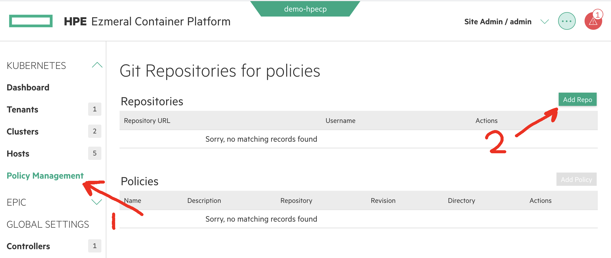
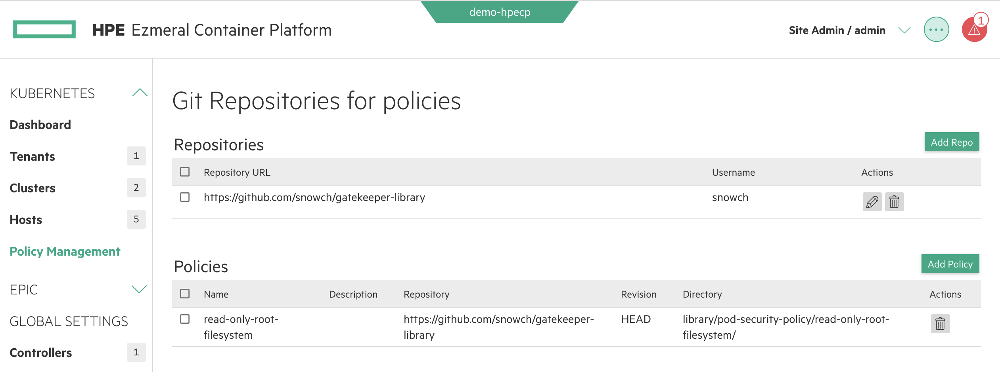
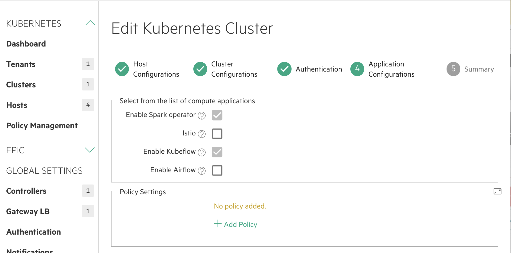
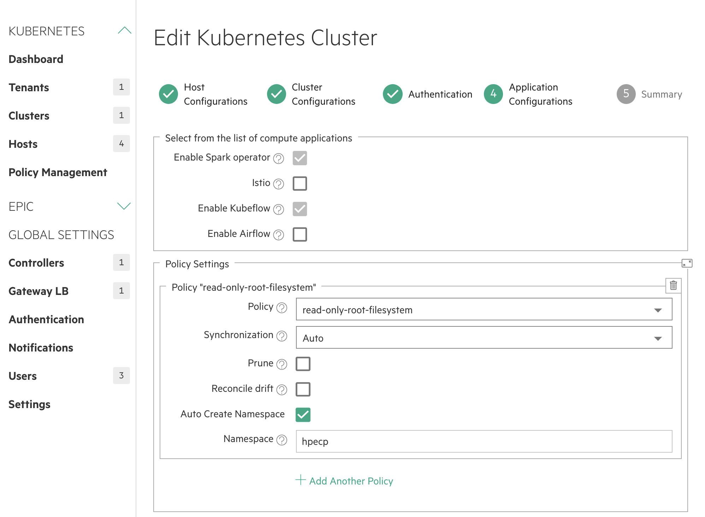

Note - Falco drivers are automatically installed on all worker nodes.


#### Step 1 - ensure you have at least the following in your `bluedata_infra.tfvars`:


```
worker_count       = 2
wkr_instance_types = [
 
    # master
    "m5.2xlarge",
     
    # workers
    "m5.4xlarge",

]
```

#### Step 2 - apply the changes to `bluedata_infra.tfvars`

```
./bin/terraform_apply.sh
```

#### Step 3 - retrieve internal IP

```
./bin/ec2_instance_status.sh
```

#### Step 4 - add hosts with falco tag

```
./bin/experimental/03_k8sworkers_add.sh HOST_IP1 HOST_IP2
```

This will output the host IDS

#### Step 5 - create cluster 

```
 ./bin/experimental/04_k8scluster_create.sh /api/v2/worker/k8shost/X /api/v2/worker/k8shost/Y
 ```
 
 Replace X with your master host ID
 Repalce Y with your worker host ID
 
#### Step 6 - configure policies

Fork https://github.com/riteshja/gatekeeper-library into your own GitHub account


In the Ezmerel CP UI:



- add your github URL that your forked
- add your github username and password
- add a policy as follows:



- name: read-only-root-filesystem
- path: library/pod-security-policy/read-only-root-filesystem

#### Step 7 - add policies to cluster

Naviate to your K8S cluster and click 'edit'.

In the policy page, add your policy:




##### Step 8 - verify argo CD build

TODO

##### Step 9 - Test policies

This should work:

kubectl apply -f - <<EOF
apiVersion: v1
kind: Pod
metadata:
  name: nginx-readonlyrootfilesystem-allowed
  labels:
    app: nginx-readonlyrootfilesystem
spec:
  containers:
  - name: nginx
    image: nginx
    securityContext:
      readOnlyRootFilesystem: true
EOF

This should fail:

kubectl apply -f - <<EOF
apiVersion: v1
kind: Pod
metadata:
  name: nginx-readonlyrootfilesystem-disallowed
  labels:
    app: nginx-readonlyrootfilesystem
spec:
  containers:
  - name: nginx
    image: nginx
    securityContext:
      readOnlyRootFilesystem: false
EOF


