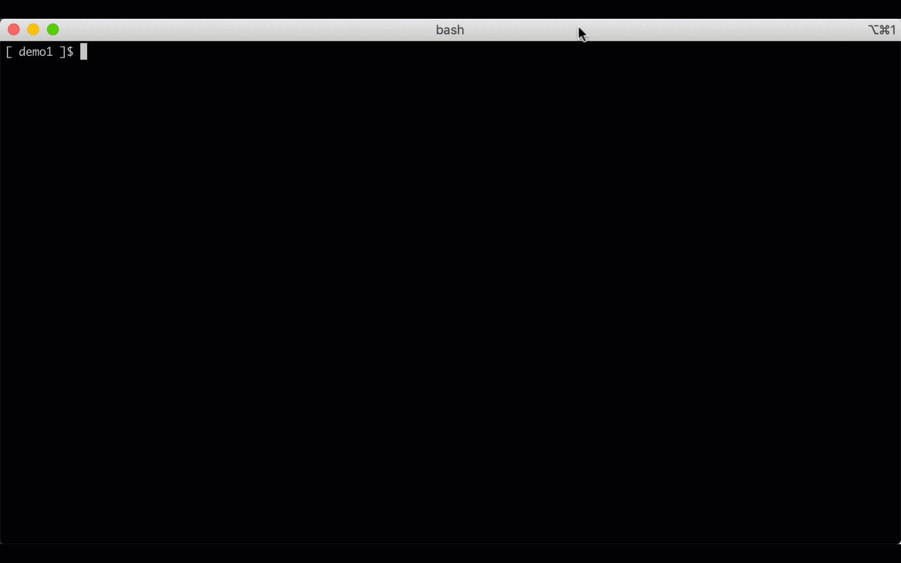
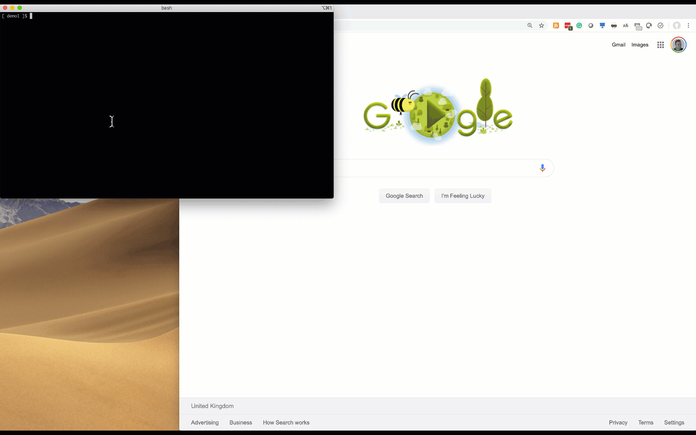

### Overview

You can enable a RDP server to be automatically configured for HPE Container Platform.

This is done in the `etc/bluedata_infra.tfvars` file.

```
rdp_server_enabled = true
rdp_server_operating_system = "LINUX"
```

This will cause the RDP server to be created the next time you run `./bin/terraform_apply.sh`.

The RDP server by default will have a dynamically assigned public IP adddress.  If you would like a static IP address (AWS EIP), configure the following option:

```
create_eip_rdp_linux_server = true
```

### Getting the Credentials

```
./generated/rdp_credentials.sh
```



### Accessing with a web browser



### Accessing with a RDP client

TODO
