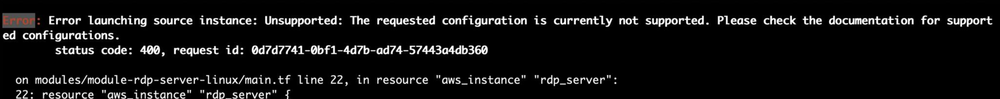
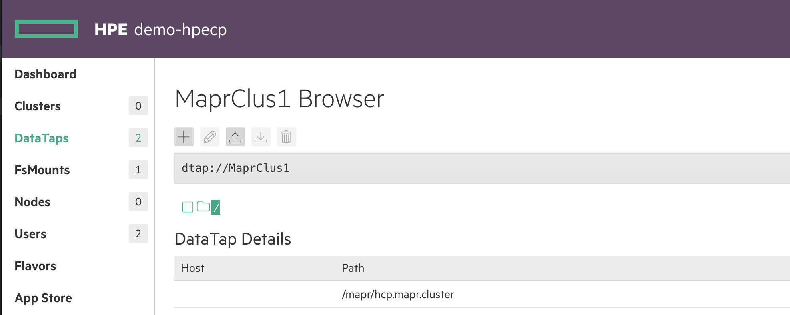
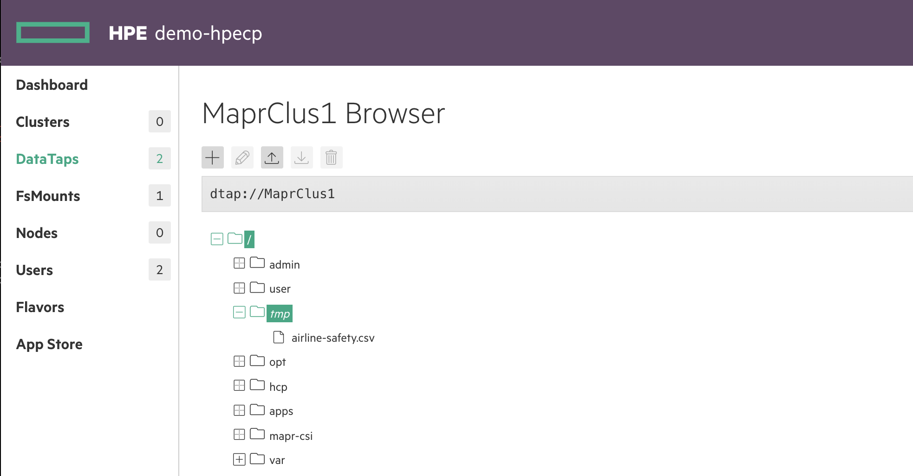

### Error: timeout - last error: SSH authentication failed

```
‘Error: timeout - last error: SSH authentication failed (centos@1.2.3.4:22): ssh: handshake failed: ssh: unable to authenticate, attempted methods [none publickey], no supported methods remain’
```

This error may occur if you some of your client's outgoing traffic is routed via. a VPN connection.

To debug this, you can try to connect directly to the server, e.g. 

```
ssh -i ./generated/controller.prv_key centos@1.2.3.4
```

If you are unable to connect to the server try disconnecting the VPN and try again.


### K8S Application Catalog is empty

SSH into the controller and restart the container `epic/authproxy:1.6`.  E.g.

```
[centos@ip-10-1-0-152 ~]$ docker ps
CONTAINER ID        IMAGE                               COMMAND                  CREATED             STATUS              PORTS               NAMES
b1023f0753eb        epic/authproxy:1.6                  "nginx -p /home/op..."   22 hours ago        Up About a minute                       epic-auth-proxy-k8s-id-1
2a81d3ec1c7b        epic/webhdfs:1.2                    "httpfs.sh run"          22 hours ago        Up About a minute                       epic-webhdfs-10.1.0.152
cac8a9c4b708        epic/monitoring:1.17                "/etc/start-all.sh..."   22 hours ago        Up 21 seconds                           epic-monitoring-10.1.0.152
dc4cc055ff3e        epic/nagios:2.4                     "/bin/sh -c '/usr/..."   22 hours ago        Up About a minute                       epic-nagios-10.1.0.152
7537305039b5        epic/mapr:6.1.0-GA-20200210022930   "/sbin/init"             22 hours ago        Up About a minute                       epic-mapr
[centos@ip-10-1-0-152 ~]$ docker restart b1023f0753eb
```

### Running Kube Director Applications are not displayed

See [above](#k8s-application-catalog-is-empty)

### Can't login to MCS - Login Failed

1. If you have just started your EC2 instances, allow a few minutes for MAPR docker container to fully start
2. If step 1 fails, ssh into the controller and restart the epic-mapr docker container (docker restart <<epic-mapr container id>>
3. If step 2 fails, restart the controller EC2 instance

### Can't connect to AD/LDAP Server

The password has likely expired.  Log into the host where the AD/LDAP is running.

```
docker ps -a
```
to get docker container ID

```
docker exec -it <container ID> /bin/bash
```

run the following command
```
samba-tool domain passwordsettings set --max-pwd-age=999
```

### Error creating VPC: VpcLimitExceeded

If you hit this issue, check that you have enough free VPCs in your AWS account and region:

```
Error: Error creating VPC: VpcLimitExceeded: The maximum number of VPCs has been reached.
```

By default AWS allows 5 VPCs per region [more info](https://docs.aws.amazon.com/vpc/latest/userguide/amazon-vpc-limits.html)

### An error occurred (IncorrectInstanceState)

If you encounter the following error when running a command, please wait a few minutes before trying again:

```
An error occurred (IncorrectInstanceState) when calling the StartInstances operation: The instance 'i-xxxxxxxxxxx' is not in a state from which it can be started.
```
or

```
An error occurred (IncorrectInstanceState) when calling the StopInstances operation: The instance 'i-xxxxxxxxxxx' is not in a state from which it can be stopped.
```

### Error launching source instance

```
Error launching source instance: Unsupported: The requested configuration is currently not supported
```

If you get this error:



Check that the instance types you have declared in `etc/bluedata_infra.tfvars` are available in the region.

In the above example, the instance type declared for the RDP server was not supported in the region required.

### RDP Server MAPR mount fails to come online after restarting EC2 instances

SSH into the RDP server:

```
./generated/ssh_rdp_linux_server.sh
```

Restart the posix client:

```
sudo service mapr-posix-client-platinum stop && sudo service mapr-posix-client-platinum start
sleep 60
ls /mapr/
```

This should return:

```
hcp.mapr.cluster
```

### MaprClus1 Datatap Browser is empty after restarting EC2 instances

See:



SSH into the controller:

```
./generated/ssh_controller.sh
```

Restart the posix client:

```
sudo service mapr-posix-client-platinum stop
sudo service mapr-posix-client-platinum start
sleep 20
ls /mapr/
```

This should return:

```
hcp.mapr.cluster
```

Now refresh the browser page and all should be fixed:


