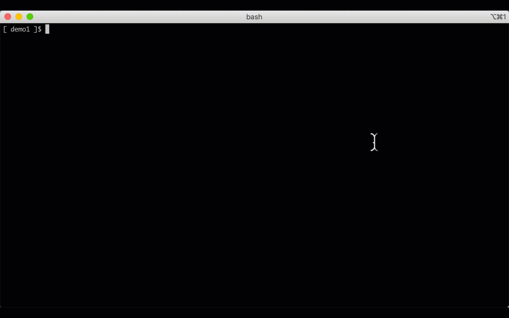

## Overview

The VPN is based on:

- https://github.com/halo/macosvpn
- https://www.softether.org/
- https://hub.docker.com/r/siomiz/softethervpn/ (at the time of writing, this uses the latest RFM release of SoftEther)

Note:

- The VPN server is provided by [SoftEther](https://www.softether.org/) running on the RDP Linux server.
- SoftEther is used because it does not have the 2 user limitation like OpenVPN.
- The SoftEther VPN server is only accessible by whitelisted client IP addresses, e.g. those managed by terraform.
- You can enable an EIP by setting the variable `create_eip_rdp_linux_server = true` in your `./etc/bluedata_infra.tfvars` file.  
- A static IP may be useful for giving other users access to the environment.
- The Mac VPN client (described below) is setup NOT to route all traffic to it.

## Server setup

- run `./generated/vpn_server_setup.sh` to create the vpn - you can run this multiple times (e.g. after adding new users).

## Mac OS VPN client management

- run `sudo ./generated/vpn_mac_connect.sh` to create vpn and to connect to it.  

- run `sudo ./generated/vpn_mac_delete.sh` to delete the vpn
- run `sudo ./generated/vpn_mac_status.sh` to report on the vpn status

## Non Mac OS VPN client management

- VPN is L2TP+IPSEC
- Pre-shared key is stored in: `./generated/vpn_shared_key` 
- Users and password are stored in: `./generated/vpn_users` 

## Add VPN Users

- Multiple usernames and passwords may be set with the following pattern: `username:password;user2:pass2;user3:pass3`
- Username and password are separated by `:`. Each pair of username:password should be separated by `;`
- If not set a single user account with username ("user1") and a random weak password is created.
- You can add users to the file: `./generated/vpn_users`
- If the file `./generated/vpn_users` doesn't exist on running `./generated/vpn_server_setup.sh`, it will be created automatically
- The pre-shared key is created automatically in the file `./generated/vpn_shared_key` 

