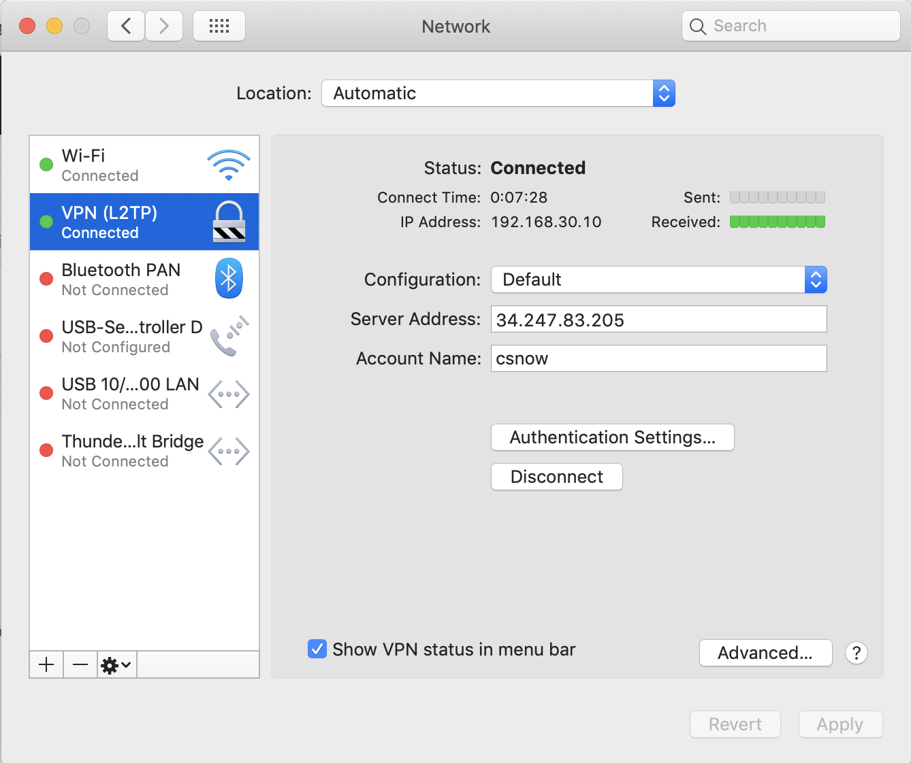
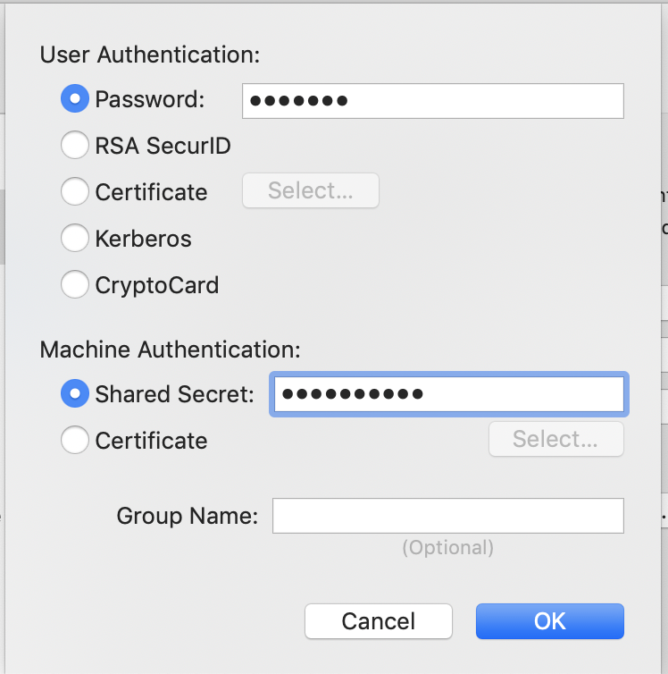

## Overview

Based on ...

- https://github.com/halo/macosvpn
- https://www.softether.org/
- https://hub.docker.com/r/siomiz/softethervpn/ (at the time of writing, this uses the latest RFM release of SoftEther)

Note:

- The vpn server is only accessible to whitelisted IP addresses using the terraform created AWS Network ACL and Security Groups.
- SoftEther is used because it does not have the 2 user limitation like OpenVPN.

## Pre-requisites

TODO: terraform project commit_id 

## Run on RDP Linux Server:

```
sudo ufw allow 1701
docker run -d --cap-add NET_ADMIN -e USERS=csnow:pass123 -p 500:500/udp -p 4500:4500/udp -p 1701:1701/tcp -p 1194:1194/udp -p 5555:5555/tcp siomiz/softethervpn
```

##  Mac Setup:

### Automatic Setup

```
command -v macosvpn >/dev/null 2>&1    || { 
    echo >&2 "I require 'macosvpn' but it's not installed.  You can install it with `brew install macosvpn`.  Aborting."; 
    exit 1;
}

sudo macosvpn create --l2tp hpe-container-platform-aws \
                        --force \
                        --endpoint $(terraform output rdp_server_public_ip) \
                        --username csnow \
                        --password pass123 \
                        --sharedsecret notasecret

networksetup -connectpppoeservice "hpe-container-platform-aws"

# VPN Status
scutil --nc list | grep hpe

sudo bash <<EOF
    route -n delete -net $(terraform output subnet_cidr_block) $(terraform output softether_rdp_ip) || ignore error
    route -n add -net $(terraform output subnet_cidr_block) $(terraform output softether_rdp_ip)
EOF
```

### Manual Setup

The server address is the RDP Public IP.  The account name is what was provided to docker in: `-e USERS=csnow:pass123`



 - For the user password, use what was provided to docker in: `-e USERS=csnow:pass123`
 - For the machine secret use `notasecret`:




## TODO

 - Use PSK, maybe even generated/controller.prv_key `-e PSK: Pre-Shared Key (PSK), if not set: "notasecret" (without quotes) by default.`
 - Provide a script to run softether docker instance with terraform
 - In the above script, it could also run the mac vpn setup tool (https://github.com/halo/macosvpn)
